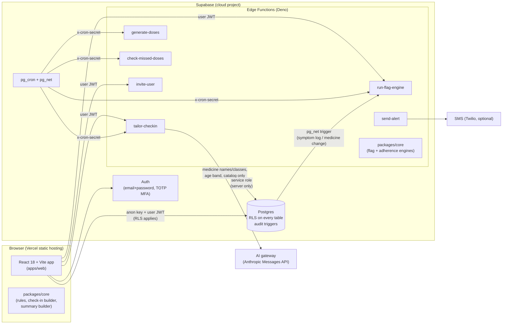

# Architecture

MedWatch is a static React app on Vercel talking directly to a hosted Supabase project.
Patient data never passes through Vercel. All clinical logic is deterministic TypeScript in
`packages/core`, shared by the browser, the Edge Functions and the seed generator.

## Repository layout

| Path                  | What lives there                                                                                                                                                                                                                                   |
| --------------------- | -------------------------------------------------------------------------------------------------------------------------------------------------------------------------------------------------------------------------------------------------- |
| `apps/web`            | React app. `src/app` (providers, router, layout, guards), `src/features/*` (one folder per feature), `src/components/ui` (design system), `src/lib` (Supabase client, API modules, logger, formatting), `src/copy` (**every** user-facing string). |
| `packages/core`       | Pure TypeScript, no I/O: rule loader, adherence engine, flag engine, visit summary builder, rules check-in builder, medication fingerprint, DST-safe time helpers, wording guard.                                                                  |
| `rules/`              | Clinical rule data (JSON) + generated JSON Schemas. See `docs/CLINICAL_RULES.md`.                                                                                                                                                                  |
| `supabase/migrations` | Schema, RLS, guards, audit, invitations, catalog, jobs/cron, reporting RPCs.                                                                                                                                                                       |
| `supabase/functions`  | Edge Functions. `_shared/` holds pure modules (AI providers, prompt, validator, tailoring orchestrator, job planners, SMS) used by both Deno and Vitest; `_shared/deno/` holds Deno-only glue (env, HTTP, auth).                                   |
| `supabase/seed`       | Deterministic synthetic data generator, guarded CLI, Supabase and Postgres writers.                                                                                                                                                                |
| `scripts/`            | Env writer, Supabase CLI wrappers, function type-check, local Postgres harness, mock Supabase server, `ai:smoke`.                                                                                                                                  |
| `tests/`              | Static tests (wording, PHI logging, bundle scan, catalog sync, vercel), function tests (AI tailoring, jobs, invitations), seed tests, DB tests (local Postgres + cloud).                                                                           |

## Key flows

**Daily check-in.** The patient's active `checkin_templates` row (core questions first, then
tailored ones) drives the one-question-per-screen flow. Answers are stored as
`symptom_logs.entries` (`{symptom_code, severity 0–3}`) — the same shape whether the template came
from AI or rules. Saving triggers `run-flag-engine` (DB trigger via `pg_net` and a call from the
app; the engine and a unique index make concurrent runs harmless).

**Tailoring.** After a medicine is added/changed/stopped, the app calls `tailor-checkin`. The
function computes the medication fingerprint; if unchanged it does nothing. Otherwise it builds the
rules draft, and — if AI is enabled and under the 3-calls-per-hour limit — asks the model to choose
and word 6–10 catalog symptoms. Output is strictly validated; on any failure it retries once and
then saves the rules template. Only metadata is recorded in `ai_requests`.

**Flag engine.** Deterministic: same inputs, same flags. Four types (temporal correlation,
medication risk, interaction, adherence) with stable dedupe keys, evidence ids for the "Why?"
panel, and severity upgrades instead of duplicates. Explanations always end "For clinician review."

**Jobs.** `pg_cron` calls the functions with a shared secret (stored in Supabase Vault):
`generate-doses` hourly (acts at each org's local midnight), `check-missed-doses` every 10 minutes,
`run-flag-engine` hourly, `tailor-checkin` nightly sweep. Each job is a pure planner plus a thin
runner, so running twice produces no duplicates.

**Reporting.** Dashboards call SECURITY INVOKER SQL functions, so aggregates respect RLS and the
browser never downloads raw dose history.

## Verification layers

| Layer                                                                                    | Runs in the sandbox | Needs the cloud project |
| ---------------------------------------------------------------------------------------- | ------------------- | ----------------------- |
| Core unit tests, AI tailoring, jobs, wording/PHI/bundle/vercel static tests (`npm test`) | ✅                  |                         |
| Migrations + RLS + audit + seed on real Postgres (`npm run test:db:local`)               | ✅                  |                         |
| Full UI flows + axe against the mock Supabase (`npm run test:e2e:mock`)                  | ✅                  |                         |
| Cloud RLS suite (`tests/db/cloud`) and Playwright E2E 1–8 (`npm run test:e2e`)           | (public pages only) | ✅                      |

The mock Supabase (`scripts/mock-supabase`) emulates the endpoints the app uses over the seeded
dataset and calls the real engines. It is a UI verification tool, never a security boundary.
