# Data model

Source of truth: `supabase/migrations/*.sql`. All tables use `uuid` primary keys
(`gen_random_uuid()`), `created_at` / `updated_at` (`timestamptz`, `updated_at` maintained by a
trigger on every table). Every table that holds patient data carries `organization_id`, which is
**forced from the patient row by a trigger** (`enforce_patient_org`) so a client can never write a
row into another organization.

```mermaid
erDiagram
  organizations ||--o{ profiles : employs
  organizations ||--o{ patients : serves
  organizations ||--o{ invitations : sends
  organizations ||--o{ audit_log : records
  profiles ||--o{ patient_links : "linked as caregiver/self"
  profiles ||--o{ caseload_assignments : "nurse"
  profiles ||--o{ alerts : receives
  patients ||--o{ patient_links : has
  patients ||--o{ caseload_assignments : "on caseload"
  patients ||--o{ consents : grants
  patients ||--o{ medications : takes
  patients ||--o{ medication_changes : history
  patients ||--o{ dose_events : scheduled
  patients ||--o{ symptom_logs : "daily check-in"
  patients ||--o{ checkin_templates : "tailored form"
  patients ||--o{ ai_requests : "AI metadata"
  patients ||--o{ flags : raises
  patients ||--o{ alerts : about
  patients ||--o{ visit_summaries : summarized
  medications ||--o{ medication_changes : changes
  medications ||--o{ dose_events : doses
  symptom_catalog ||..o{ symptom_logs : "entries[].symptom_code"
  symptom_catalog ||..o{ checkin_templates : "questions[].symptom_code"

  organizations {
    uuid id PK
    text name
    text timezone
    jsonb settings
  }
  profiles {
    uuid id PK "= auth.users.id"
    uuid organization_id FK
    text role "patient|caregiver|nurse|agency_admin"
    text full_name
    text email
    text phone
    bool sms_opt_in
    timestamptz sms_opt_in_at
    bool mfa_required
    bool is_active
  }
  patients {
    uuid id PK
    uuid organization_id FK
    text first_name
    text last_name
    date date_of_birth
    uuid primary_nurse_id FK
    text notes
    text status "active|discharged"
    timestamptz last_visit_at
  }
  patient_links {
    uuid id PK
    uuid organization_id FK
    uuid patient_id FK
    uuid profile_id FK
    text relationship "self|caregiver"
  }
  caseload_assignments {
    uuid id PK
    uuid organization_id FK
    uuid nurse_id FK
    uuid patient_id FK
  }
  consents {
    uuid id PK
    uuid organization_id FK
    uuid patient_id FK
    text consent_type "data_use|sms|caregiver_access"
    text granted_by_name
    text granted_by_relationship
    timestamptz granted_at
    timestamptz revoked_at
    text document_version
  }
  medications {
    uuid id PK
    uuid organization_id FK
    uuid patient_id FK
    text name
    text generic_name
    text drug_class
    text purpose
    numeric dose_amount
    text dose_unit
    text route
    text frequency_label
    text_array schedule_times "HH:MM local"
    bool prn
    date start_date
    date end_date
    text status "active|stopped"
    text prescriber_name
  }
  medication_changes {
    uuid id PK
    uuid organization_id FK
    uuid patient_id FK
    uuid medication_id FK
    text change_type
    jsonb previous
    jsonb current
    date effective_date
    uuid recorded_by FK
  }
  dose_events {
    uuid id PK
    uuid organization_id FK
    uuid patient_id FK
    uuid medication_id FK
    timestamptz scheduled_for "unique with medication_id"
    text status "pending|given|missed|skipped|refused"
    timestamptz confirmed_at
    uuid confirmed_by FK
    text confirmation_method
    text verification "reported|verified"
    text note
  }
  symptom_catalog {
    text code PK
    text label
    text plain_label
    text help_text
    text category
    bool is_core
    int sort_order
  }
  symptom_logs {
    uuid id PK
    uuid organization_id FK
    uuid patient_id FK
    date logged_for_date "unique with patient_id"
    uuid logged_by FK
    jsonb entries "[{symptom_code, severity 0-3}]"
    int overall_feeling "1-5"
    text free_text
  }
  checkin_templates {
    uuid id PK
    uuid organization_id FK
    uuid patient_id FK
    text medication_fingerprint
    text source "ai|rules|default"
    jsonb questions
    text model
    text prompt_version
    text status "active|superseded"
  }
  ai_requests {
    uuid id PK
    uuid organization_id FK
    uuid patient_id FK
    text purpose
    text model
    text status "success|invalid_output|error|timeout"
    int latency_ms
    int input_tokens
    int output_tokens
  }
  flags {
    uuid id PK
    uuid organization_id FK
    uuid patient_id FK
    text flag_type
    text severity "low|medium|high"
    text status "open|acknowledged|dismissed|escalated"
    text title
    text explanation
    jsonb evidence
    text rule_id
    text dedupe_key
    uuid reviewed_by FK
    timestamptz reviewed_at
    text review_note
  }
  alerts {
    uuid id PK
    uuid organization_id FK
    uuid patient_id FK
    uuid recipient_profile_id FK
    text channel "in_app|sms"
    text alert_type "missed_dose|flag|escalation"
    uuid related_id
    timestamptz sent_at
    timestamptz read_at
    text delivery_status
  }
  visit_summaries {
    uuid id PK
    uuid organization_id FK
    uuid patient_id FK
    uuid generated_by FK
    date period_start
    date period_end
    jsonb content
  }
  audit_log {
    uuid id PK
    uuid organization_id FK
    uuid actor_id
    text action "view|create|update|delete|export|login"
    text entity_type
    uuid entity_id
    jsonb changes "changed column names only"
  }
  invitations {
    uuid id PK
    uuid organization_id FK
    text email
    text role
    text full_name
    uuid patient_id FK
    text token_hash "sha256, unique"
    uuid invited_by FK
    timestamptz expires_at "7 days"
    timestamptz accepted_at
  }
```

## Organization settings (`organizations.settings`)

| Key                           | Default  | Meaning                                                                                                                        |
| ----------------------------- | -------- | ------------------------------------------------------------------------------------------------------------------------------ |
| `missed_dose_grace_minutes`   | 60       | A pending dose becomes `missed` this long after its scheduled time; caregivers are alerted.                                    |
| `agency_escalation_minutes`   | 120      | Still unconfirmed this long after schedule → escalation alert to the primary nurse and admins.                                 |
| `flag_min_severity_for_alert` | `medium` | Flags at or above this severity send an alert to the care team.                                                                |
| `flag_dedupe_hours`           | 72       | A flag with the same `dedupe_key` is not re-created inside this window (and the engine only evaluates symptom days inside it). |
| `session_timeout_minutes`     | 15       | Idle sign-out; a warning appears 1 minute before.                                                                              |

## Notable constraints

- `dose_events (medication_id, scheduled_for)` unique → dose generation is idempotent.
- `symptom_logs (patient_id, logged_for_date)` unique → one check-in per day, edits update the row (audited).
- `checkin_templates`: partial unique index → exactly one `active` template per patient.
- `alerts (recipient_profile_id, alert_type, related_id, channel)` unique → alert jobs cannot double-send.
- `medication_changes` is immutable (update/delete blocked by trigger; removed only by a patient hard-delete cascade).
- `audit_log` is append-only (update/delete/truncate blocked for every role, including the owner).

## Indexes

Every `organization_id` and `patient_id` column is indexed, plus `dose_events (scheduled_for, status)`,
`flags (organization_id, status, severity)`, `symptom_logs (patient_id, logged_for_date)`,
`flags (patient_id, dedupe_key)`, `alerts (recipient_profile_id, read_at)` and `audit_log (organization_id, created_at)`.

## Reporting functions

Aggregations used by dashboards run in SQL (security invoker, so RLS applies) to avoid shipping
thousands of rows to the browser. See `20261006000007_reporting.sql`.
